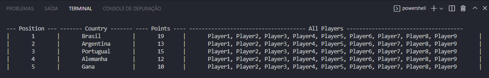

    <h1> Singleton_in_python </h1>
    Aplicação de Design Patterns em um pequeno projeto

    <h2> Getting Started 

    Podemos verificar abaixo o resultado deste sistema, em que foi utilizado o Singleton, um dos Design Patterns; em sua concepção:

    

    <h2> Desenvolvimento </h2>
    

